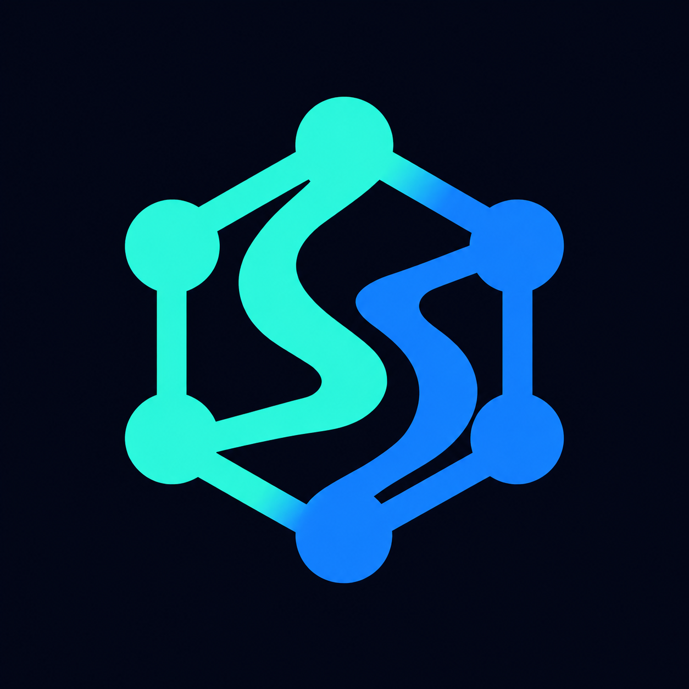

# SAM Mesh

A native [Agent Zero](https://github.com/agent0ai/agent-zero) community plugin for
[Sovereign Agent Mesh](https://github.com/google/sam). Discover services, review the
destination and data before a remote call, and keep approvals and activity in Agent Zero.

Discover and call mesh services with scoped, single-use approvals; run native mesh inference;
publish a bounded specialist with Embassy; or use the optional Sovereign deployment to confine
Agent Zero to approved mesh and named egress routes. Explorer remains the default.
See [compatibility](docs/compatibility.md) and the [release assessment](docs/release-readiness.md)
for the tested versions, certification evidence and supported deployment limits.

Native installation, scope, lifecycle and browser verification are documented in
[Native community integration](docs/native-community.md). The standalone plugin is
[MIT licensed](LICENSE). See the [release](https://github.com/TerminallyLazy/a0-sam-mesh/releases/tag/v1.0.0)
for the installable ZIP, checksums, and verification report.

## What you can do

- Explore the connected node, service catalog, remote tool schemas, and available models.
- Give each project and agent profile its own allowlists, data limits, and call budget.
- Review unknown-risk calls once, for one exact destination and payload, before dispatch.
- Use SAM through Agent Zero's native model provider or a destination-approved request form.
- Inspect redacted activity and disconnect a scope locally, even while the node is offline.
- Publish three bounded Embassy tools with verified caller identity and isolated native sessions.
- Run Sovereign on a Linux host that passes its complete runtime certification.

## Install and connect

Use an existing Agent Zero framework environment with Python 3.12+, HTTPX/HTTPcore,
cryptography, jsonschema, PyYAML, OpenAI/LiteLLM, and FastMCP 3 for Embassy.
The separate agent execution Python is not the framework environment. This repository
does not install SAM, enroll a node, change node identity, or start a daemon.

1. Open Agent Zero's **Plugins** screen and install from the repository URL
   `https://github.com/TerminallyLazy/a0-sam-mesh`, or upload the ZIP from the release.
   The native installer places it at `/a0/usr/plugins/sam_mesh`.
2. Check **SAM Mesh** is enabled for the intended project/profile. Agent Zero
   enables newly installed plugins by default; Explorer grants no remote-call authority.
3. Open its settings under MCP or External. Explorer is the default. Set the node endpoint
   and transport, then save and open **Mesh Observatory** from settings, the plugin list’s Open action,
   or the right canvas. Select a chat to inspect its saved passport.
4. Start with Node and Catalog. A partial catalog is not proof that every peer is online.

For UDS, mount the SAM socket directory into the Agent Zero container, set `socket_path`
and keep a valid HTTP base URL as the local HTTP authority. No token is sent over UDS.
Linux procfs, safe parent ownership/modes, and a socket under `/run/sam` or `/var/run/sam`
are required. Other socket roots require an explicit trusted-runtime integration; they are not accepted as ordinary plugin settings.

For TCP, `127.0.0.1` means the Agent Zero container itself. A SAM service in another container
needs its Docker network name and actual port. Non-localhost names require an exact
`allowed_origins` entry in the transport configuration. Connections resolve and pin an IP,
verify the connected peer, and retain the hostname for TLS. Redirects and environment
proxy discovery are disabled.

Store a token in Agent Zero's project secrets, then configure only `token_secret_name`.
Alternatively reference a private token file on the server with `token_file`; do not
configure two sources. Never put a node token in ordinary JSON settings or chat.

## Governed remote calls

Enable Guarded Mesh and `remote_calls`, set an explicit service allowlist, remove the default
`deny_tools: ["*"]` only after replacing it with the intended denial rules, choose a positive
calls-per-chat limit, and allow mutations with approval if required. Denials take precedence.

Use the nine `sam_*` tools for discovery and preflight. A canonical identifier such as
`mcp://research-desk/summarize` is preserved exactly. Current SAM does not return remote MCP
risk annotations, so those calls have an **unknown-risk floor** and require a single-use
operator approval. Missing annotations are never reported as verified safe metadata.

Review a decision in Observatory → Routes and type `APPROVE`. It binds the exact scope,
recipient, service, schema, passport, payload, route and data class. Approval expires within
five minutes. Call `sam_call_remote_tool` with the decision ID once. Changes require new preflight.
For non-public data, use the protected form; do not paste sensitive arguments into chat.

## Native inference

Enable mesh inference in the passport and feature settings and set a positive calls-per-chat limit. In Observatory → Routes,
enter a discovered model and review the provider settings. Use **SAM Mesh** in Agent Zero's
normal chat/utility settings with the exact displayed API base. No nested agent is created.
The adapter supplies a pinned, non-retrying client immediately before each native call.

Prefer the plugin's project-secret reference and leave the host provider's optional API-key
field empty. Agent Zero's generic model-search UI uses its own HTTP client and does not run
this plugin's transport guard. Use the Observatory inference catalog for guarded discovery.
If using an existing `SAM_MESH_API_KEY` provider credential, its generic host model-search
behavior remains outside this plugin's transport certification.

Automatic routes can fail over between eligible providers; labels use **any-of** matching.
They do not establish an exact recipient. For a protected named request, use the Routes form,
review the freshly discovered peer/service, approve once, then send the approved request.
Named requests use only `X-Sam-Authentication` for the local node: SAM forwards an
`Authorization` header on named proxies to the remote provider.

## Controls and independent tracks

- **Emergency disconnect** closes the project/profile's local dispatch barrier and revokes
  approvals across its chats, even with broken configuration or an offline SAM node. Work
  already admitted may finish. **RESUME** reopens the current passport without restoring
  old decisions or resetting quotas.
- **Activity** shows redacted, chained audit events. Exports contain aliases and fingerprints,
  never full protected arguments or lease bearers.
- **Native MCP** offers a review-only compatibility plan. Automatic registration and Raw MCP
  are unavailable because host disabled-tool lists cannot deny newly added gateway tools.
- **Embassy** starts a reviewed broker through native authenticated controls. An isolated
  operator gateway signs SAM-authenticated peer identity; sessions stay bound to the caller
  and service. The operator applies the reviewed static SAM registration and removes it
  when withdrawing. Version 1 specialists can use only the response tool. See
  [Embassy operations](docs/embassy-operations.md).
- **Sovereign** uses published SAM binaries, a TUN interface, a credential-verified boundary
  and a separate ingress-only UI gateway. It requires a fresh, matching certification on
  the deployment host. The tested Docker Desktop LinuxKit kernel is unsupported. See
  [Sovereign operations](docs/sovereign-operations.md).

Read the [security contract](docs/security.md), [operations runbook](docs/operations.md),
and [verification instructions](docs/verification.md) before operating a non-Explorer scope.

## License

[MIT](LICENSE). Copyright 2026 A0 SAM Mesh Embassy contributors.
