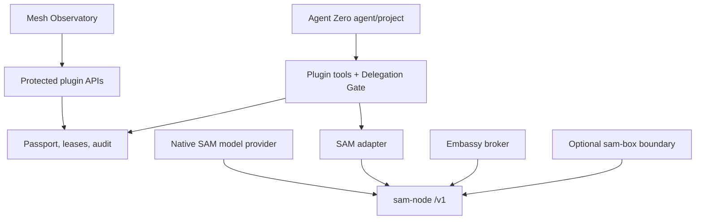

# A0 SAM Mesh Embassy — Design Specification

**Status:** approved design  
**Date:** 2026-08-31  
**Plugin ID:** `sam_mesh`  
**Community repository:** `a0-sam-mesh`  
**Audited Agent Zero snapshot:** [`6a6cecff`](https://github.com/agent0ai/agent-zero/commit/6a6cecff8527b164668c7a6ab2f76b6b1ed7cfa1)  
**Audited SAM snapshot:** [`3224aae8`](https://github.com/google/sam/commit/3224aae8dc962d6e8d4a83c4fa1f2d3e84c6db0f)  
**Research basis:** [`docs/research/a0-sam-plugin-research.md`](../../research/a0-sam-plugin-research.md)

## 1. Product thesis

A0 SAM Mesh Embassy makes Agent Zero a governed participant in the Sovereign Agent Mesh rather than a generic MCP client. It gives each Agent Zero project/profile an explainable capability contract, makes SAM inference native to Agent Zero, permits carefully bounded inbound delegation, and optionally adds a `sam-box` deployment boundary that enforces network policy outside the agent process.

The product has four separable planes:

1. **Capability plane:** discover, describe, approve, invoke, and audit SAM tools.
2. **Cognition plane:** use SAM's OpenAI-compatible inference as a native Agent Zero provider.
3. **Embassy plane:** publish explicitly selected Agent Zero specialists/projects as mesh services.
4. **Sovereign boundary:** optionally force Agent Zero traffic through `sam-box` in a companion deployment.

The safe default is a plugin-owned adapter and Delegation Gate. Direct Agent Zero MCP registration remains an advanced/read-only acceleration path, not the universal security boundary.

## 2. Goals

- Install as a normal Agent Zero community plugin without replacing the user's deployment.
- Default to read-only Explorer mode with no silent enrollment, execution, publication, or sensitive-data transmission.
- Give every project/profile a human-readable Capability Passport.
- Support SAM's TCP Streamable HTTP endpoint and HTTP-over-UDS sidecar endpoint.
- Discover actual capabilities at runtime through health, MCP initialization, `tools/list`, and schema probes.
- Give remote tool calls destination-aware policy, real human approval leases, and an auditable preflight.
- Register SAM as an Agent Zero chat provider so mesh inference can power the normal A0 loop.
- Offer resilient automatic inference and named/pinned inference as visibly different trust choices.
- Publish bounded Agent Zero specialists through a local broker without exposing the whole A0 tool surface.
- Supply a capability-gated `sam-box` deployment pack for enforced ingress/egress.
- Ship a full v1 program with independent release gates rather than a throwaway minimal adapter.

## 3. Non-goals

- Replacing SAM's control plane, Biscuit verification, DHT discovery, or libp2p data plane.
- Claiming a distinct SAM identity merely because Agent Zero has a different profile.
- Implementing a global mesh topology or reputation system that SAM cannot authoritatively provide.
- Treating SAM pubsub as a durable queue.
- Claiming A2A, semantic intent search, real peer messaging, or full OpenAI API coverage before runtime support is verified.
- Letting a model approve its own risky action with a `confirm=true` argument.
- Enforcing all network traffic from plugin Python code; that belongs to the companion deployment.

## 4. Distribution and repository contract

The community-plugin runtime files remain at repository root so the repository can be installed directly into `usr/plugins/sam_mesh`:

```text
a0-sam-mesh/
├── plugin.yaml
├── default_config.yaml
├── README.md
├── LICENSE
├── requirements.txt
├── execute.py
├── helpers/
├── tools/
├── prompts/
├── skills/sam-mesh/SKILL.md
├── api/
├── webui/
├── extensions/
├── conf/model_providers.yaml
├── tests/
├── scripts/
└── deploy/
    ├── compose/
    ├── sam-node/
    ├── sam-box/
    ├── policies/
    ├── healthchecks/
    └── upgrade/
```

`plugin.yaml` uses:

```yaml
name: sam_mesh
title: A0 SAM Mesh Embassy
description: Governed SAM tools, mesh inference, and optional sovereign Agent Zero service publication.
version: 1.0.0
settings_sections:
  - mcp
  - external
per_project_config: true
per_agent_config: true
always_enabled: false
```

Plugin configuration is scope-aware. Direct MCP server configuration remains Agent Zero global/project scoped and must not be presented as profile-specific.

## 5. Operating modes

| Mode | Remote discovery | Remote calls | Mesh inference | Inbound service | External enforcement |
|---|---:|---:|---:|---:|---:|
| `explorer` | Yes | No | No | No | No |
| `guarded_mesh` | Yes | Through Delegation Gate | Yes | No | No |
| `raw_mcp` | Native MCP surface | User-selected broad gateway | Optional | No | No |
| `embassy` | Yes | Guarded | Yes | Allowlisted broker | No |
| `sovereign` | Yes | Guarded | Yes | Capability-gated | `sam-box` |

Fresh installs use `explorer`. Mode escalation is an authenticated UI action and is recorded in the audit log.

## 6. System architecture



### 6.1 Agent Zero boundary

- Native plugin tools receive separate Agent Zero identities such as `plugin:sam_mesh:sam_discover_services` and `plugin:sam_mesh:sam_call_remote_tool`.
- Read-oriented direct MCP tools may also be registered with identities such as `mcp:sam_mesh:get_mesh_info`.
- Direct `mcp:sam_mesh:call_remote_tool` stays disabled in Explorer and Guarded Mesh modes.
- Plugin tools, APIs, and helpers run in Agent Zero's framework runtime.
- Remote results are untrusted content even after transport authorization succeeds.

### 6.2 SAM boundary

- `sam-node` owns enrollment, peer identity, signed claims, discovery, authorization, routing, and service registration.
- `sam-box` owns sandbox boundary enforcement when Sovereign mode is installed.
- A0 SAM never interprets discovery gossip as authorization evidence; SAM verifies signed provider identity before forwarding request bytes.

## 7. Core domain model

All persisted JSON/YAML objects carry a schema identifier and reject unknown enum values.

### 7.1 Enums

```python
class OperatingMode(StrEnum):
    EXPLORER = "explorer"
    GUARDED_MESH = "guarded_mesh"
    RAW_MCP = "raw_mcp"
    EMBASSY = "embassy"
    SOVEREIGN = "sovereign"

class DataClass(StrEnum):
    PUBLIC = "public"
    INTERNAL = "internal"
    CONFIDENTIAL = "confidential"
    REGULATED = "regulated"

class RiskLevel(StrEnum):
    READ_ONLY = "read_only"
    NETWORK = "network"
    MUTATION = "mutation"
    DESTRUCTIVE = "destructive"
    FINANCIAL = "financial"
    CREDENTIAL = "credential"
    UNKNOWN = "unknown"

class RouteMode(StrEnum):
    AUTOMATIC = "automatic"
    PINNED = "pinned"
```

### 7.2 Capability Passport

Schema ID: `a0.sam.passport/v1alpha1`.

Required fields:

- `mode`
- `outbound.max_data_class`
- `outbound.allow_services[]`
- `outbound.deny_tools[]`
- `outbound.remote_mutations`
- `inference.enabled`
- `inference.route_mode`
- `inference.required_labels[]`
- `inference.sensitive_data`
- `limits.calls_per_session`
- `limits.timeout_seconds`
- `limits.approval_lease_minutes`
- `inbound.enabled`
- `inbound.services[]`

Default values are fail-closed: Explorer mode, remote execution/inference/inbound disabled, `max_data_class=public`, 30-second discovery timeout, 90-second call timeout, and 15-minute maximum approval lease.

### 7.3 Tool descriptor

`ToolDescriptor` retains canonical `mcp://<service>/<tool>`, peer ID, service, description, input/output schemas, labels, discovery timestamp, discovery source, and SHA-256 schema hash. The canonical URI returned by SAM is never rewritten.

### 7.4 Preflight decision

`PreflightDecision` contains:

- stable decision ID;
- passport scope and version hash;
- destination and tool descriptor;
- classified data fields and `DataClass`;
- `RiskLevel` and evidence for that classification;
- route mode and required labels;
- retry/duplicate warning;
- `allow`, `deny`, or `needs_approval` outcome;
- human-readable reasons;
- expiration timestamp.

### 7.5 Capability lease

Schema ID: `a0.sam.lease/v1alpha1`. A lease is server-generated, stored outside model-visible history, and bound to project, profile, chat, peer, service, canonical tool URI, schema hash, argument hash or data boundary, invocation count, expiration, and approving user when available.

Mutation/destructive/financial/credential leases are single-use. Any destination, schema, profile, passport, or data-class change invalidates the lease.

### 7.6 Audit event

Schema ID: `a0.sam.audit/v1alpha1`. The append-only event records event type, timestamp, scope, chat, redacted destination, decision/lease ID, risk/data class, route mode, outcome, latency, retry count, error taxonomy, and integrity-chain hash. It never stores raw secrets or complete sensitive arguments.

Default retention is 30 days or 10,000 events per scope, whichever limit is reached first. Export is explicit and redacted.

## 8. Core plugin components

### 8.1 Configuration resolver

`helpers/config.py` loads Agent Zero's scoped plugin configuration and produces a validated `ResolvedConfig`. It accepts only `http` or `uds` transport, normalizes URLs without following untrusted redirects, validates UDS paths against an allowlisted mount prefix, and resolves a token by secret reference or token-file path. Raw token values are not accepted in ordinary plugin configuration.

### 8.2 SAM adapter

`helpers/sam_client.py` provides:

```python
class SamClient:
    async def health(self) -> NodeHealth: ...
    async def initialize_mcp(self) -> McpCapabilities: ...
    async def list_tools(self) -> list[ToolDescriptor]: ...
    async def call_mcp_tool(self, name: str, arguments: dict) -> ToolResult: ...
    async def list_models(self) -> list[MeshModel]: ...
    async def chat_completion(self, request: ChatRequest, route: InferenceRoute) -> AsyncIterator[bytes]: ...
```

TCP uses Streamable HTTP and node authentication. UDS uses HTTP over a Unix-domain socket. The implementation supports JSON and event-stream MCP responses, preserves the MCP session header, applies size/time limits, and maps errors into `SamAuthError`, `SamPolicyError`, `SamConnectivityError`, `SamSchemaError`, `SamProviderError`, and `SamPartialResult`.

### 8.3 Capability probing

`helpers/capabilities.py` probes health/readiness, MCP initialize, `tools/list`, exact tool input schemas, `/v1/models`, and optional agent/sandbox endpoints. It does not trust the MCP implementation version `0.1.0` as a compatibility indicator.

The resulting `CompatibilityReport` contains per-feature `supported`, `missing`, `schema_mismatch`, or `unreachable` status and the tested node binary metadata when observable.

### 8.4 Catalog and schema cache

Discovery results are cached for 60 seconds by project/profile and query. Partial results and per-peer errors remain visible. Schema changes invalidate prior leases and require re-description.

### 8.5 Risk classifier

The classifier is deterministic and conservative. It combines:

- configured URI rules;
- read-only/destructive annotations when present;
- method/name patterns;
- schema fields such as `delete`, `write`, `amount`, `credential`, or file paths;
- explicit operator overrides.

Missing annotations never reduce risk. Unknown tools are `unknown` and require an exact single-use lease.

### 8.6 Delegation Gate

The gate executes `discover -> describe -> classify -> route -> policy -> approval -> invoke -> inspect -> audit`. The plugin blocks direct generic remote invocation in safe modes so the model cannot bypass preflight.

SAM's ambiguous transport retries are shown on every mutation route card. The adapter adds an idempotency key only when the remote schema or operator mapping identifies a supported field/header; it never fabricates compatibility.

### 8.7 Native tools

The core plugin ships:

- `sam_mesh_status`
- `sam_list_local_services`
- `sam_discover_services`
- `sam_find_tools`
- `sam_describe_tool`
- `sam_preflight_tool`
- `sam_call_remote_tool`
- `sam_list_models`
- `sam_route_preview`

Each prompt contains an exact JSON schema. Bootstrap/join/publication are not model tools.

### 8.8 Setup and lifecycle

Enrollment and daemon actions live in authenticated UI/API flows. `execute.py` performs a short, idempotent diagnostic only: binary detection, version output, path checks, health, and cleanup guidance. It does not run an interactive OIDC join or own a long-running foreground service.

## 9. Mesh Observatory

The Observatory is a right-canvas surface plus a settings card. It contains:

1. **Node:** endpoint, transport, enrollment/readiness, token expiry, compatibility probes.
2. **Catalog:** services, peer IDs, labels, tool schemas, cached/partial/error state.
3. **Routes:** automatic/pinned inference, eligible providers, label filters, route preview.
4. **Activity:** approvals, calls, denials, retries, latency, and redacted audit events.
5. **Embassy:** inbound services, callers, limits, health, drain, and emergency closure.

Every fact is labeled `verified_now`, `cached`, `partial`, `unreachable`, `schema_changed`, or `unsupported`. The emergency disconnect revokes leases, disables remote execution/inference/inbound, and optionally stops plugin-owned registrations; it does not reset SAM identity.

## 10. Cognitive Relay

The plugin contributes `sam_mesh` as an Agent Zero chat provider through `conf/model_providers.yaml` using LiteLLM's OpenAI chat mode and `/models` discovery. A0 model presets supply the SAM `/v1` API base. The node token is stored in Agent Zero's masked provider credential store and sent through the `Authorization` compatibility path for `/v1`; it is not duplicated in plugin config.

Native provider support is limited to HTTP-reachable SAM endpoints. UDS remains available for the plugin's own tools. Sovereign mode uses `http://mesh.sam.alt/v1` without an agent-held token.

Two route experiences are explicit:

- **Resilient Mesh:** automatic local-first routing/failover constrained by required labels.
- **Named Sovereign:** a pinned peer/service proxy with exact destination disclosure.

Native Agent Zero provider configuration is the default for ordinary chat/utility use. A guarded plugin inference API is retained only for route preview, pinned recipient approval, and compatibility diagnostics—not as a nested replacement agent.

Release gates verify streaming, non-streaming, tool-call payloads, model listing, context errors, auth errors, 404 model errors, 503 provider exhaustion, and retry behavior.

## 11. Embassy Publisher

Embassy mode exposes only declared service definitions:

```yaml
inbound:
  enabled: true
  services:
    - name: evidence-reviewer
      type: mcp
      project: pediatric-evidence-review
      agent_profile: researcher
      persistence: isolated_chat
      allowed_tools: [send_message, finish_chat]
      max_runtime_seconds: 300
      max_input_bytes: 262144
      max_attachment_bytes: 0
      requests_per_minute: 6
```

The broker maps a SAM-verified origin to a service definition, creates or resumes an isolated chat according to policy, applies project/profile selection, enforces size/time/rate/concurrency limits, and records origin facts. It never exposes arbitrary project names, Agent Zero credentials, filesystem paths, or the complete tool catalog.

Publication is explicit and reversible. The UI renders a generated `sam-node.yaml` service fragment using `type: mcp`, a stable service name, description, and local `target_url`. Publication health must pass before advertisement. Disable/drain withdraws the service before terminating active sessions.

Current source supports `mcp` and `inference`; the plugin does not publish `a2a` until runtime/source support is verified.

## 12. Sovereign Deployment Pack

The pack targets one `sam-node` per host and one `sam-box` per Agent Zero sandbox. Agent Zero runs with no general network device beyond the injected tun/loopback path; `tun2socks` sends named TCP flows to the bind-mounted `sam-box` socket.

Inside Agent Zero:

```text
OPENAI_BASE_URL=http://mesh.sam.alt/v1
SAM_MCP_URL=http://mesh.sam.alt/mcp
```

The agent holds no SAM node token. `sam-box` exposes only `/v1/models`, `/v1/chat/completions`, `/v1/completions`, and `/mcp` at `mesh.sam.alt`, plus explicitly allowlisted external names. Specific mesh services use `<service>.<type>.sam.alt`.

The pack is marked experimental until runtime probes confirm the required `sam-box` flags and connector operations. Current documented gaps—secret injection, ingress reverse channel, and credential rotation—remain visible blockers; the pack must fail closed rather than emulate them insecurely. [Sandbox Gateway](https://sam-mesh.dev/docs/user/secure-gateway/)

Agent Zero WebUI access is preserved through an explicit host-facing ingress sidecar or loopback namespace arrangement; Sovereign mode must not accidentally expose a general egress interface merely to publish the WebUI.

## 13. Security model

### 13.1 Trust layers

| Layer | Enforces |
|---|---|
| Human/operator | Enrollment, mode escalation, approval leases, publication |
| A0 SAM plugin | Data class, destination, tool risk, session limits, audit |
| Agent Zero Tool Access | Native plugin/MCP tool availability and execution gate |
| SAM control plane/node | Identity claims, peer binding, service/target authorization |
| `sam-box` | Named ingress/egress at sandbox boundary |

No layer is represented as a substitute for another.

### 13.2 Required protections

- No raw token in plugin config, tool args, prompts, audit events, logs, or chat history.
- UDS path allowlist and mode/ownership validation.
- No redirects to unapproved hosts.
- Request body maximum 16 MiB or lower passport limit; UI/broker defaults are much lower.
- MCP result/media/resource size limits before history insertion.
- SSRF protection for operator-entered endpoints and publisher target URLs.
- HTML/UI output escaping and schema rendering without executable content.
- Lease tokens never exposed to the model; tools receive only an opaque decision ID and server retrieves the lease.
- Audit exports are redacted and integrity-checkable.
- Remote result instructions cannot elevate tool access or reuse approval.
- Emergency disconnect always works without a functioning mesh.

## 14. Failure semantics

User-visible errors preserve distinctions:

- `auth_required` / `auth_rejected`
- `node_not_ready`
- `policy_denied`
- `destination_unavailable`
- `partial_discovery`
- `schema_changed`
- `approval_required` / `approval_expired`
- `model_not_found`
- `provider_exhausted`
- `duplicate_execution_possible`
- `unsupported_capability`

The plugin never collapses these into a generic “SAM failed.” Read-only operations may retry within configured limits. Mutations never add extra plugin retries on top of SAM's own ambiguous retry behavior.

## 15. Compatibility policy

- CI tests the audited Agent Zero commit and the current supported Agent Zero main head.
- SAM matrix initially includes `v0.1.0-alpha.7` and audited/current main builds.
- Feature support is determined by runtime probes and exact schemas.
- A changed required tool schema disables the dependent feature and raises `schema_mismatch`.
- `raw_mcp` is never automatically enabled after upgrade.
- `sovereign` stays experimental until its required capabilities exist in a published SAM release and all enforcement tests pass.

## 16. Testing strategy

- Unit tests: config validation, passport matching, data/risk classification, schema hashes, leases, audit redaction/chain, error mapping.
- Contract tests: fake SAM sidecar for TCP and UDS, MCP session headers, JSON/event-stream responses, all required SAM tool schemas.
- Agent Zero integration: plugin discovery, scoped config, tool policy, prompt schemas, protected APIs, WebUI surface, model provider merge.
- SAM integration: released and current-main containers; discovery, describe/call, model facade, publication lifecycle.
- Adversarial: prompt injection in tool results, schema mutation, SSRF endpoints, replayed/expired leases, duplicate mutation response loss, oversized bodies, credential leakage.
- Deployment: `network=none`, allowed/denied domain tests, DNS exfiltration denial, WebUI reachability, emergency disconnect, upgrade/rollback.

## 17. Success metrics

- Zero raw-secret occurrences across config API responses, tool history, logs, and audit exports in automated scans.
- 100% of mutation calls have a single-use lease or are denied.
- 100% of schema changes invalidate matching leases.
- 100% of unsupported capabilities render as unavailable rather than silently degrading authority.
- P95 local preflight overhead under 150 ms excluding SAM discovery/network time.
- Observatory status refresh under 2 seconds against a healthy local node.
- Emergency disconnect completes local revocation within 500 ms.
- Sovereign negative tests demonstrate zero unapproved named TCP egress.

## 18. Release structure

The full v1 program is delivered through four independently reviewable plans:

1. Core plugin, Capability Passport, Delegation Gate, and Mesh Observatory.
2. Cognitive Relay native model-provider integration.
3. Embassy Publisher inbound broker and publication lifecycle.
4. Sovereign Deployment Pack with `sam-box` enforcement.

Core may reach stable status before the other tracks. Cognitive Relay and Embassy remain beta until their integration matrices pass. Sovereign remains experimental until SAM's published release contains the required runtime contracts.

## 19. Primary references

- [Agent Zero README](https://github.com/agent0ai/agent-zero/blob/6a6cecff8527b164668c7a6ab2f76b6b1ed7cfa1/README.md)
- [Agent Zero plugin contract](https://github.com/agent0ai/agent-zero/blob/6a6cecff8527b164668c7a6ab2f76b6b1ed7cfa1/plugins/AGENTS.md)
- [Agent Zero MCP client](https://github.com/agent0ai/agent-zero/blob/6a6cecff8527b164668c7a6ab2f76b6b1ed7cfa1/helpers/mcp_handler.py)
- [Agent Zero tool policy](https://github.com/agent0ai/agent-zero/blob/6a6cecff8527b164668c7a6ab2f76b6b1ed7cfa1/helpers/tool_policy.py)
- [Agent Zero provider merge](https://github.com/agent0ai/agent-zero/blob/6a6cecff8527b164668c7a6ab2f76b6b1ed7cfa1/helpers/providers.py)
- [SAM node configuration](https://sam-mesh.dev/docs/user/node-configuration/)
- [SAM agent usage](https://sam-mesh.dev/docs/user/agent-usage/)
- [SAM policy reference](https://sam-mesh.dev/docs/development/policy/)
- [SAM sandbox gateway](https://sam-mesh.dev/docs/user/secure-gateway/)
- [SAM agent architecture](https://sam-mesh.dev/docs/agent-architecture/)
- [SAM MCP implementation](https://github.com/google/sam/blob/3224aae8dc962d6e8d4a83c4fa1f2d3e84c6db0f/internal/node/mcp.go)
- [SAM sidecar implementation](https://github.com/google/sam/blob/3224aae8dc962d6e8d4a83c4fa1f2d3e84c6db0f/internal/node/sidecar.go)
- [SAM inference facade](https://github.com/google/sam/blob/3224aae8dc962d6e8d4a83c4fa1f2d3e84c6db0f/internal/node/openai_facade.go)
